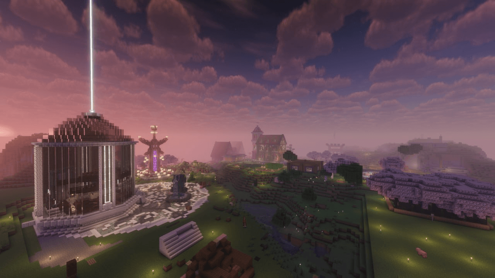

<div align="center">



# Project server

**Сайт для сервера Minecraft 26.1.2**

[](https://www.minecraft.net)
[](https://fabricmc.net)
[](#)
[](#)

🌐 **Сайт проекта:** [site.tklch.xyz](https://site.tklch.xyz)

</div>

---

## ️ О самом сайте

Это статический сайт‑лендинг проекта, собранный **на чистом HTML / CSS / JavaScript** — без фреймворков и сборщиков.

Что умеет:

-  **Живой статус сервера** — онлайн, слоты и ники игроков тянутся в реальном времени через публичный API [`mcstatus.io`](https://mcstatus.io) (с фолбэком через CORS‑прокси, чтобы работало отовсюду)
- **Twitch‑детект эфира без API‑ключа** — честно определяет по наличию preview‑картинки на CDN Twitch; по клику открывает официальный плеер в модалке
- **Галерея построек** с lightbox на весь экран и ленивой загрузкой
- **Отдельная страница правил**  в едином стиле
- Парящий полароид летящие частицы, scroll‑reveal, адаптив под мобилки
- **SEO‑обвязка** — мета‑теги, Open Graph, schema.org (JSON‑LD), `sitemap.xml`, `robots.txt`

---

## 🚀 Запуск локально

1. Склонируй репозиторий:
   ```bash
   git clone https://github.com/yungdv/tklch-site.git
   cd tklch-site
   ```
2. Открой папку в **VS Code** и запусти через расширение **Live Server** (ПКМ по `index.html` → *Open with Live Server*), либо просто открой `index.html` в браузере.

---

## 🙏 Credits

**yungdv** · [github.com/yungdv](https://github.com/yungdv)
